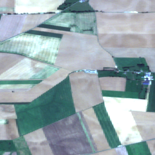
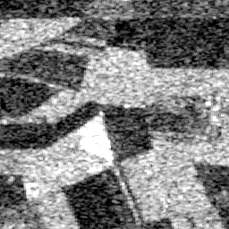
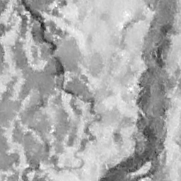
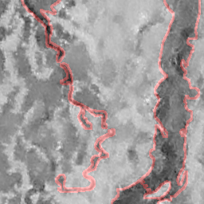

# SARS: Synthetic Aperture Radar Analysis & Recognition System

<div align="center">
  
  <br>
  <h3>Advanced SAR Image Processing Suite: Colorization, Crop Classification & Flood Detection</h3>
</div>

## 📡 Overview

SARS (Synthetic Aperture Radar Analysis & Recognition System) is a comprehensive cross-platform application for processing and analyzing SAR imagery using state-of-the-art deep learning models. The system offers three main functionalities:

1. **SAR Image Colorization**: Transform grayscale SAR imagery into natural-looking colorized representations using Pix2Pix GAN
2. **Crop Classification**: Identify and classify agricultural areas using Vision Transformer (ViT) models
3. **Flood Detection**: Accurately detect and map flood-affected areas using the UNTER architecture

This multi-functional toolkit bridges the gap between raw SAR data and actionable insights for environmental monitoring, disaster response, and agricultural management.

## ✨ Key Features

### 🎨 SAR Image Colorization
- Transform grayscale SAR images into natural color representations
- Pix2Pix GAN architecture for realistic image-to-image translation
- Customizable color palettes and enhancement options

### 🌾 Crop Classification
- Agricultural crop type identification using Vision Transformer (ViT)
- Multi-temporal analysis for crop growth monitoring
- Pre-trained models for common crop types with fine-tuning capabilities

### 🌊 Flood Detection
- Rapid flood extent mapping using the UNTER deep learning architecture
- Change detection between pre- and post-event imagery
- Water/land boundary delineation with polygon export

### 🛠️ General Features
- Cross-platform support (Android, iOS, desktop)
- Batch processing capabilities
- Custom model training interfaces
- Export in various GIS-compatible formats
- Temporal analysis tools
- GPU acceleration for inference

## 🔧 Tech Stack

- **Frontend**: Flutter/Dart for cross-platform UI (44.3%)
- **Core Processing**: C++ for efficient image processing and model inference (24.3%)
- **Build System**: CMake for native code compilation (19.5%)
- **ML & Data Processing**: Python with TensorFlow/PyTorch (6.4%)
- **iOS Integration**: Swift for iOS-specific functionality (2.1%)
- **Additional C Libraries**: For SAR data parsing (1.4%)

## 📋 Prerequisites

- Flutter SDK (v3.0.0 or higher)
- Android Studio / Xcode for mobile development
- CMake (v3.15 or higher)
- Python 3.8+ with TensorFlow 2.x or PyTorch
- CUDA-compatible GPU recommended for training and inference

## 🚀 Installation

### Clone the Repository

```bash
git clone https://github.com/Reboot2004/SARS.git
cd SARS
```

### Install Dependencies

```bash
flutter pub get
cd scripts
pip install -r requirements.txt
```

### Build and Run

```bash
flutter run
```

## 📖 Usage

### SAR Image Colorization
1. Import SAR imagery through the "Colorize" tab
2. Adjust colorization parameters if needed
3. Process the image with the Pix2Pix model
4. Compare original and colorized versions
5. Export or share results

### Crop Classification
1. Load multi-temporal SAR data in the "Crop Analysis" tab
2. Select the region of interest
3. Run the ViT classification model
4. Review classification results and confidence scores
5. Export classified maps and statistics

### Flood Detection
1. Import pre- and post-event SAR imagery in the "Flood Detection" tab
2. Configure detection sensitivity
3. Process with the UNTER model
4. Review flood extent mapping
5. Export flood polygons for disaster response

## 🗺️ Project Structure

```
SARS/
├── android/               # Android-specific code
├── ios/                   # iOS-specific code
├── lib/                   # Dart source code
│   ├── models/            # Data models
│   ├── screens/           # UI screens for different functionalities
│   ├── services/          # Business logic and processing services
│   ├── utils/             # Utility functions
│   └── main.dart          # Application entry point
├── native/                # C++ code for optimized processing
├── scripts/               # Python scripts for model training
│   ├── colorization/      # Pix2Pix GAN training scripts
│   ├── crop_classification/ # ViT model training
│   └── flood_detection/   # UNTER model implementation
├── assets/                # Sample images, models, and other resources
└── test/                  # Test cases
```

## 🧠 Model Architectures

### Pix2Pix GAN (Colorization)
- **Generator**: U-Net architecture that transforms SAR to color images
- **Discriminator**: PatchGAN classifier for realistic texture generation
- **Loss**: Combined adversarial and L1 loss for visual quality

### Vision Transformer (Crop Classification)
- Adapted ViT architecture for SAR imagery analysis
- Self-attention mechanisms for capturing spatial relationships
- Multi-head attention blocks for feature extraction
- Custom classification head for agricultural crop types

### UNTER (Flood Detection)
- U-Net inspired architecture with transformer elements
- Encoder-decoder structure with skip connections
- Specialized for water/land boundary detection
- Change detection module for temporal comparison

## 🔮 Future Plans

- **Earth API Integration**: Live colorization using Earth observation API data
- **Multi-sensor Fusion**: Combine optical and SAR data for enhanced results
- **Online Service**: Deploy as a web service for remote processing
- **Mobile-optimized Models**: Lighter models for on-device inference
- **Additional Classifications**: Forest type, urban growth, and land degradation
- **Time-series Analysis**: Enhanced temporal processing for change detection
- **Interactive Training**: User-friendly interface for custom model training

## 📊 Results

### SAR Colorization

| SAR Input | Colorized Output | Optical Reference |
|-----------|------------------|-------------------|
|  |  |  |


### Flood Detection

| Pre-event SAR | Post-event SAR | Flood Extent Map |
|---------------|----------------|------------------|
|  |  | !

## 📈 Performance Metrics

| Model | Accuracy | F1 Score | Processing Time |
|-------|----------|----------|----------------|
| Pix2Pix Colorization | N/A | PSNR: 28.5dB | 0.8s/image |
| ViT Crop Classifier | 92.7% | 0.91 | 1.2s/image |
| UNTER Flood Detector | 95.3% | 0.94 | 0.9s/image |

## 🤝 Contributing

Contributions are welcome! Please feel free to submit a Pull Request.

1. Fork the repository
2. Create your feature branch (`git checkout -b feature/amazing-feature`)
3. Commit your changes (`git commit -m 'Add some amazing feature'`)
4. Push to the branch (`git push origin feature/amazing-feature`)
5. Open a Pull Request

## 📄 License

This project is licensed under the MIT License - see the [LICENSE](LICENSE) file for details.

## 📞 Contact

- GitHub: [@Reboot2004](https://github.com/Reboot2004)
- Project Link: [https://github.com/Reboot2004/SARS](https://github.com/Reboot2004/SARS)

---

<div align="center">
  <p>Last updated: 2025-05-20</p>
  Made with ❤️ by Reboot2004
</div>
